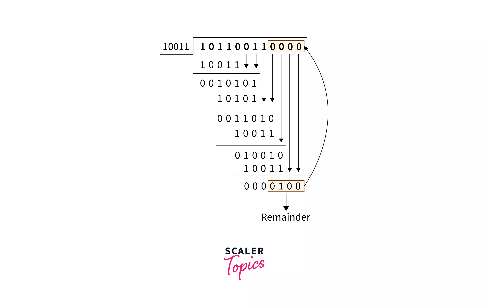
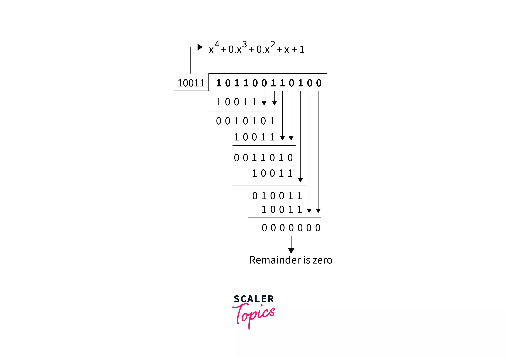
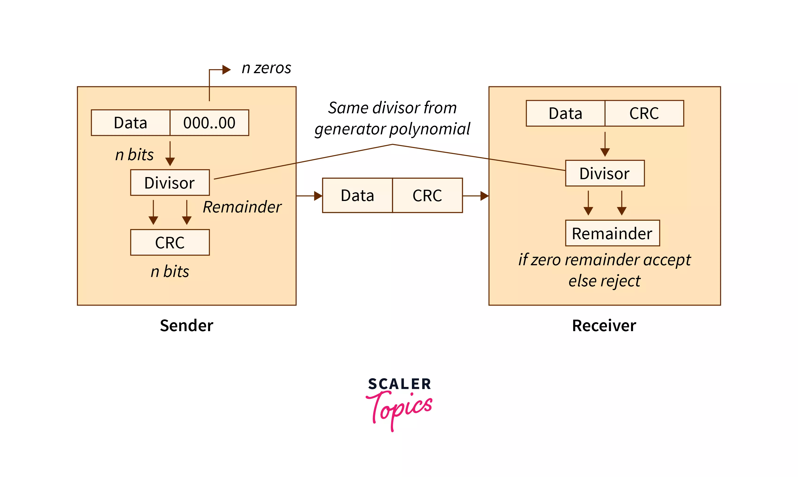

Uplink: [000_MOC_BCS-041](000_MOC_BCS-041.md)

---
- CRC is error-detection and correction method.
- CRC uses generator polynomial which is available at the sender and re4ceiver end.
- This method is used at the data-link layer.
- If sender data length `M` bits and `R` is the highest degree of generator polynomial that generates the CRC bits. Then the sender will send `(M+R)` bits.
- When the dividend is divided by the divisor the remainder is appended to the dividend. The number of remainder bits should be the same as highest degree of the generator polynomial function.

## Example and Explanation

### CRC generation

### CRC Generator and checker

---
## Resources
- [CRC by Scaler](https://www.scaler.com/topics/computer-network/cyclic-redundancy-check/#what-is-a-cyclic-redundancy-check-)
- 