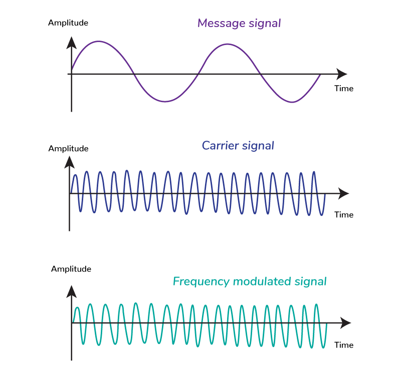

uplink: [Modulation](Modulation.md)

---
## Definition
- In frequency modulation the frequency of the carrier signal is changed in response to message signal amplitude.
- Amplitude and phase remains the same in the case of frequency modulation.
- It is the most/primarily used in radio broadcasting. 
## Diagram

## How it works
- In frequency modulation the frequency of the carrier signal is changed in response to message signal amplitude.

## Advantages and disadvantages
### Advantages
- **Resilient to noise:** Most noise are amplitude based which can be filtered by passing the signal through a limiter so that only frequency variation appear.
- **Resilient to signal strength variation:** signal variation is reduced by reducing the mise. Amplitude variation is reduced.
- Linear amplifier doesn't needed since only frequency is being changed.
- High transmission efficiency.
### Disadvantages
- Required more complicated demodulation circuit.
- Sidebands extends to infinity both sides.